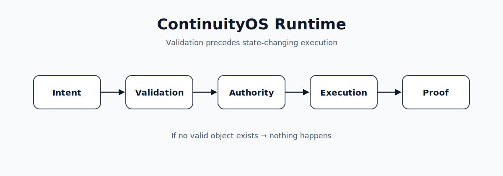

# ContinuityOS



ContinuityOS is distributed legitimacy infrastructure for execution-capable systems.

This repository contains a Cloudflare Worker and D1-backed runtime, conformance harnesses, portable demos, and governance artifacts for validating state-changing actions before execution. It exists to make execution-capable AI and automation systems fail closed: an action is executed only when the exact proposed object is valid, authorized, unused, policy-compliant, replay-safe, topology-visible, reconcilable, epoch-valid, and convergence-valid.

---

## Quick Start

Use these paths to evaluate the runtime without reading the full repository first.

| Demo | Purpose | Command | More information |
| --- | --- | --- | --- |
| Governed Filesystem Demo | Shows the existing `POST /gateway/tool/filesystem-write` route enforcing validation before a local filesystem mutation. | `npm install`<br>`npm run demo` | [`demo/portability/README.md`](demo/portability/README.md), [`docs/issues/first-installable-path.md`](docs/issues/first-installable-path.md) |
| Merge Guard | Provides a packaged GitHub Action that checks a pull request identity object and optional author policy, then returns `VALID` or `NULL` with a proof artifact. | See workflow example below. | [`actions/continuity-merge-guard/README.md`](actions/continuity-merge-guard/README.md) |
| LangChain Integration | Wires the same governed filesystem route into a LangChain `DynamicStructuredTool`; the tool itself contains no filesystem-write logic. | `npm run demo:langchain` | [`demo/integrations/langchain/README.md`](demo/integrations/langchain/README.md), [`governed-filesystem-tool.mjs`](demo/integrations/langchain/governed-filesystem-tool.mjs) |
| GitHub Portability Demo | Applies the same execution contract to a second mutation surface: creating a GitHub issue comment. | `npm run demo:portability:github` | [`demo/portability/README.md`](demo/portability/README.md#portability-second-mutation-surface-github-issue-comment) |

### Governed Filesystem Demo

The fastest way to see the runtime in action is the governed filesystem demo. It requires no Cloudflare credentials and runs against the existing `POST /gateway/tool/filesystem-write` route.

```bash
npm install
npm run demo
```

Expected output:

```text
VALID        → proof receipt + lineage node, validated_object_hash == executed_object_hash
Replay NULL  → no new proof, no new lineage
Policy NULL  → fails closed, no proof, no lineage
```

### Merge Guard

A second installable wedge: a packaged GitHub Action that checks a pull request's identity object (`repo`, `pr_number`, `head_sha`, `base_sha`, `actor`) plus optional explicit author policy (`author-kind`, `require-agent-authored`), hashes it, and returns `VALID` or `NULL` (fail-closed) with a proof artifact — designed to be added as a required status check.

```yaml
- uses: joselunasrt8-creator/ContinuityOS-/actions/continuity-merge-guard@v0.1.0
  with:
    repo: ${{ github.repository }}
    pr-number: ${{ github.event.pull_request.number }}
    head-sha: ${{ github.event.pull_request.head.sha }}
    base-sha: ${{ github.event.pull_request.base.sha }}
    actor: ${{ github.event.pull_request.user.login }}
```

`@v0.1.0` is the published, pinnable version. `@main` remains usable for exploration but is not recommended once a consumer treats the result as load-bearing (a required status check).

#### Live external consumer

[`joselunasrt8-creator/continuityos-sandbox`](https://github.com/joselunasrt8-creator/continuityos-sandbox) installs Merge Guard at `@v0.1.0` and has made `merge-guard` a **required** status check on its `main` branch — `LOAD-BEARING_ACTIVE`. Real PRs in that repo have exercised both outcomes: a `VALID` result allows merge, and a `NULL` result reports `failure` and leaves the PR `blocked`. See that repo's `LOAD_BEARING_READINESS.md` and `NULL_ENFORCEMENT_PROOF.md` for the evidence.

---

## What is ContinuityOS?

AI systems can generate proposed actions. ContinuityOS validates those actions before execution, permits execution only for valid objects, and emits proof only after successful execution.

```text
Intent
↓
Validation
↓
Authority
↓
Execution
↓
Proof
```

A proposed action is only executed if it passes validation. If validation fails — for example because of a replayed nonce or denied path — nothing executes and nothing is recorded.

### Canonical runtime flow

```text
/session
→ /continuity
→ /authority
→ /compile
→ /validate
→ /execute
→ /proof
```

All state-changing execution surfaces are expected to route through this lifecycle.

---

## Core Invariants

> [!IMPORTANT]
> If no valid object exists<br>
> → nothing happens

> [!IMPORTANT]
> `validated_object == executed_object`

> [!CAUTION]
> Mutation after validation<br>
> → boundary violation

> [!IMPORTANT]
> Replay<br>
> → `NULL`

---

## Runtime Architecture

```text
Agent
↓
ContinuityOS Runtime
↓
┌────────────┬───────────┬────────┬────────┬────────┐
│ Validation │ Authority │ Replay │ Policy │ Proof  │
└────────────┴───────────┴────────┴────────┴────────┘
↓
Execution Surface
```

Execution gate:

```text
VALID ∧ AUTHORIZED ∧ UNUSED ∧ POLICY_VALID
∧ REPLAY_SAFE ∧ TOPOLOGY_VISIBLE
∧ RECONCILABLE ∧ EPOCH_VALID ∧ CONVERGENCE_VALID
```

ContinuityOS does not replace intelligence. It enforces legitimacy before execution.

---

## Core Principles

- deterministic validation
- exact-object execution
- exact-object discipline
- replay resistance
- fail-closed behavior
- proof persistence
- non-bypassable execution boundaries
- authority integrity
- continuity lineage

---

## Repository Layout

| Path | Description |
| --- | --- |
| `demo/` | Governed execution demos, portability examples, and integration examples. |
| `runtime/` | Runtime-facing implementation area where present in the repository topology. |
| `gateway/` | Gateway-facing execution boundary area where present in the repository topology. |
| `actions/` | Installable GitHub Actions, including Continuity Merge Guard. |
| `docs/` | Canon, implementation plans, semantics, audits, and adoption documentation. |
| `conformance/` | Portable conformance packs, vectors, suites, and evidence artifacts. |
| `cli/` | Command-line entry points and SDK helpers. |
| `continuity-core/` | Rust core primitives and conformance tests. |
| `.github/` | CI workflows, issue templates, and repository automation. |

---

## Documentation

| Document | Purpose |
| --- | --- |
| [`QUICKSTART.md`](QUICKSTART.md) | Stage 1 and Stage 2 developer quickstart. |
| [`docs/governed-deploy-quickstart.md`](docs/governed-deploy-quickstart.md) | Stage 1 governed deploy walkthrough. |
| [`docs/stage2-legitimacy-vocabulary.md`](docs/stage2-legitimacy-vocabulary.md) | 12-state distributed legitimacy vocabulary. |
| [`docs/reconciliation-state-machine.md`](docs/reconciliation-state-machine.md) | Reconciliation state machine. |
| [`docs/topology-visibility-semantics.md`](docs/topology-visibility-semantics.md) | Topology visibility semantics. |
| [`docs/causal-legitimacy-clock-semantics.md`](docs/causal-legitimacy-clock-semantics.md) | Causal legitimacy clock semantics. |
| [`docs/stage2-conformance-matrix.md`](docs/stage2-conformance-matrix.md) | Stage 2 conformance matrix (`CONF-DIST-01`–`15`). |
| [`docs/stage2-distributed-legitimacy-enforcement-plan-v1.md`](docs/stage2-distributed-legitimacy-enforcement-plan-v1.md) | Stage 2 plan. |
| [`docs/glossary.md`](docs/glossary.md) | Canonical terminology. |

---

## Product Positioning

```text
Continufy
│
├── MindShift
│   Understand systems
│
├── SYNAPSE
│   Analyze systems
│
└── ContinuityOS
    Govern execution
```

ContinuityOS is the runtime infrastructure project derived from the MindShift canon. MindShift remains the canon and research umbrella; ContinuityOS is the runtime substrate. ContinuityOS governs whether state-changing actions are permitted to exist before execution occurs.

MindShift discovered the canon. ContinuityOS operationalizes it.

---

## Recorded Demo Evidence

The output below is a real run of `npm run demo` from a clean checkout (`demo/portability/filesystem-governed-execution.mjs`). It is shown here so the governed-execution wedge can be evaluated without running anything.

Full transcript (clone → `npm install` → `npm run demo`): [`demo/portability/RECORDED_DEMO.md`](demo/portability/RECORDED_DEMO.md)

### VALID — execution + proof

```json
{
  "status": "EXECUTED",
  "target_path": "governed/filesystem-write-gateway/seed.md",
  "bytes_written": 49,
  "receipt_id": "sha256:11d01f34c0a16ee6f2d280b6306170e9bba7c211a0ca1ba11fe7971bff7353a5",
  "validated_object_hash": "sha256:e41c6e2d731642223b6f1a1a0a05058a6042b176c19a4eefe5545b49cf82fadc",
  "executed_object_hash": "sha256:e41c6e2d731642223b6f1a1a0a05058a6042b176c19a4eefe5545b49cf82fadc",
  "exact_object_preserved": true,
  "proof_persisted": true,
  "lineage_persisted": true,
  "proof_lineage_bound": true
}
```

`validated_object_hash == executed_object_hash` — the object that was validated is the exact object that was executed. A proof receipt and a lineage node were both persisted and are bound to each other.

### REPLAY_NULL — execution blocked, no proof

The same `replay_nonce` is resubmitted with different content.

```json
{
  "agent_visible_response": {
    "result": "NULL",
    "execution_performed": false,
    "proof_emitted": false,
    "correlation_id": "null_evt_cef02c9657297af9fd3e3e055240a2c5"
  },
  "operator_audit_record": {
    "reason_class": "REPLAY_NULL",
    "stage": "replay",
    "denial_reason": "REPLAY_NONCE_CONSUMED"
  },
  "no_new_proof": true,
  "no_new_lineage": true
}
```

The agent receives only a bounded, non-enumerating NULL response. The full diagnostic detail (`reason_class`, `stage`, `denial_reason`) is recoverable by an operator from the internal audit registry via `correlation_id`, but is never exposed to the calling agent.

### POLICY_NULL — execution blocked, no proof

A write to a denied path (`wrangler.toml`) is attempted.

```json
{
  "agent_visible_response": {
    "result": "NULL",
    "execution_performed": false,
    "proof_emitted": false,
    "correlation_id": "null_evt_9b3ffaa49994d4381d79dda187b19cdb"
  },
  "operator_audit_record": {
    "reason_class": "POLICY_NULL",
    "stage": "validate",
    "denial_reason": "PATH_NOT_ALLOWED"
  },
  "no_new_proof": true,
  "no_new_lineage": true
}
```

Same bounded shape, same fail-closed result: no write, no proof, no lineage — regardless of *why* execution was denied.

### GitHub portability evidence

```json
{
  "status": "EXECUTED",
  "target_owner": "joselunasrt8-creator",
  "target_repo": "mindshift-demo",
  "target_issue_number": 1954,
  "validated_object_hash": "sha256:50b536ace02934020397ea3498d626a7eab28c5325958a131593e0a90425f29a",
  "executed_object_hash": "sha256:50b536ace02934020397ea3498d626a7eab28c5325958a131593e0a90425f29a",
  "exact_object_preserved": true,
  "comment_id": "demo-comment-0001",
  "comment_url": "https://github.com/joselunasrt8-creator/mindshift-demo/issues/1954#issuecomment-demo-0001"
}
```

Same contract shape, second mutation surface: `validated_object_hash == executed_object_hash`, and a `VALID`/`NULL` validator boundary, now applied to an external GitHub API mutation instead of a local filesystem write.

---

## Conformance

This repository contains a portable conformance harness demonstrating that legitimacy observability infrastructure can operate outside the canonical runtime with minimal dependency friction.

### What this demonstrates

- Conformance pack-v1 executes with no dependency on the canonical runtime.
- Governance evidence artifacts are emitted deterministically.
- CI-visible evidence is published on every pack-relevant change.
- Governance vocabulary is portable before runtime adoption occurs.

### What this does not demonstrate

- Runtime legitimacy.
- Authority issuance.
- Execution permission.
- Distributed proof finality.
- Deployment.

### Running the conformance harness

Requirements: Node.js >= 18, shell.

```bash
node conformance/pack-v1/harness.mjs
```

or via the runner script:

```bash
./scripts/run-conformance.sh
```

Expected output (all vectors passing):

```text
CONFORMANCE_EVIDENCE_OBSERVED
VALIDATION_FAIL_CLOSED_CONFIRMED
REPLAY_CONSUMPTION_PRESERVED
PROOF_APPEND_ONLY_CONFIRMED
CONVERGENCE_CLASSIFICATION_CORRECT
PACK_V1_CONFORMANCE_COMPLETE
```

Evidence artifact written to: `conformance/pack-v1/conformance-pack-v1-evidence.json`<br>
Reference snapshot at: `evidence/latest.json`

### Governance Boundary

```text
conformance evidence  ≠  authority
badge                 ≠  execution permission
observability         ≠  legitimacy
fixture pass          ≠  runtime governance
visibility            ≠  legitimacy
```

The conformance harness is:

- **Evidence-only** — it reads static fixtures and emits structured output.
- **Non-operative** — it does not create authority, perform deployment, or mutate runtime state.
- **Fail-closed** — if any vector fails, the harness exits non-zero and CI fails.

The purpose is observability, comparability, and governance vocabulary portability. Not runtime governance, authority issuance, or distributed proof finality.

---

## Repository Governance and Contribution Model

Repository mutation governance is enforced through:

- Apache-2.0 licensing
- `CODEOWNERS`
- `SECURITY.md`
- `CONTRIBUTING.md`
- governed pull request flow
- deterministic validation expectations

Direct mutation paths that bypass review/governance are considered invalid architecture.

ContinuityOS accepts bounded, reviewable contributions that preserve canonical invariants. See [`CONTRIBUTING.md`](CONTRIBUTING.md), [`SECURITY.md`](SECURITY.md), and [`CODEOWNERS`](CODEOWNERS).

---

## Install-Base Interpretation

Install base is **not** stars, downloads, chatbot usage, or prompts.

Install base **is**:

```text
workflow dependency
+
execution dependency
+
governance dependency
```

Install-base expansion starts when external systems depend on your governance vocabulary before they depend on your runtime. This repository is the first external proof that legitimacy observability infrastructure is portable — demonstrating governance vocabulary can become an external dependency surface before runtime adoption occurs.
